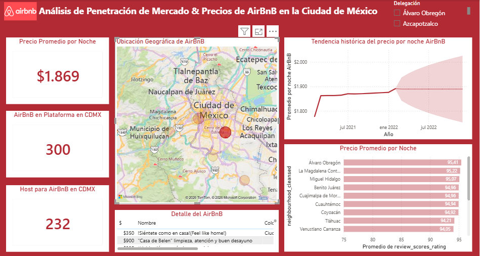
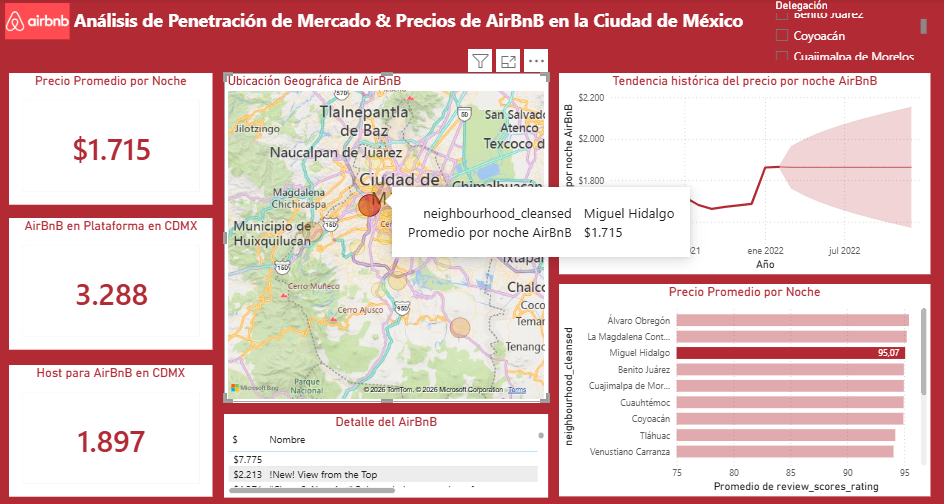
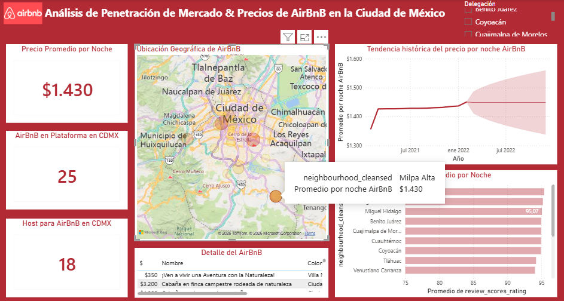

# Dashboard Airbnb - Ciudad de México

Proyecto desarrollado en **Microsoft Power BI** para el análisis de datos de alojamientos de Airbnb en Ciudad de México. El dashboard integra procesos de limpieza y transformación de datos con **Power Query**, así como medidas y métricas creadas mediante **DAX**, permitiendo explorar información clave de forma visual e interactiva.

---

## Objetivos del proyecto

- Analizar el comportamiento de los precios de los alojamientos.
- Explorar la disponibilidad y características de las propiedades.
- Visualizar indicadores clave mediante tarjetas, gráficos y mapas.
- Aplicar transformaciones de datos y medidas DAX para apoyar el análisis.

---

## Algunas imágenes del dashboard interactivo

A continuación se muestran algunas capturas del dashboard desarrollado en Power BI:

---

## Herramientas utilizadas

- Microsoft Power BI Desktop
- Power Query
- DAX

---

## Archivos del proyecto

-  `Informe_BI_Udemy.pbix` – Archivo editable del informe de Power BI.
-  `Informe_BI_Udemy.pdf` – Versión del dashboard exportada en formato PDF.

---

## Nota

Este repositorio contiene el archivo fuente del dashboard, una versión en PDF y algunas capturas de pantalla para mostrar el diseño y las principales visualizaciones del informe.
